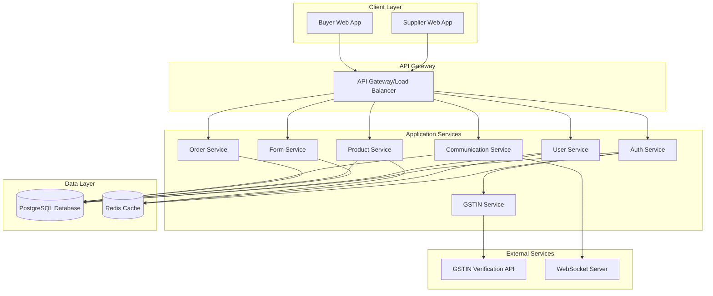
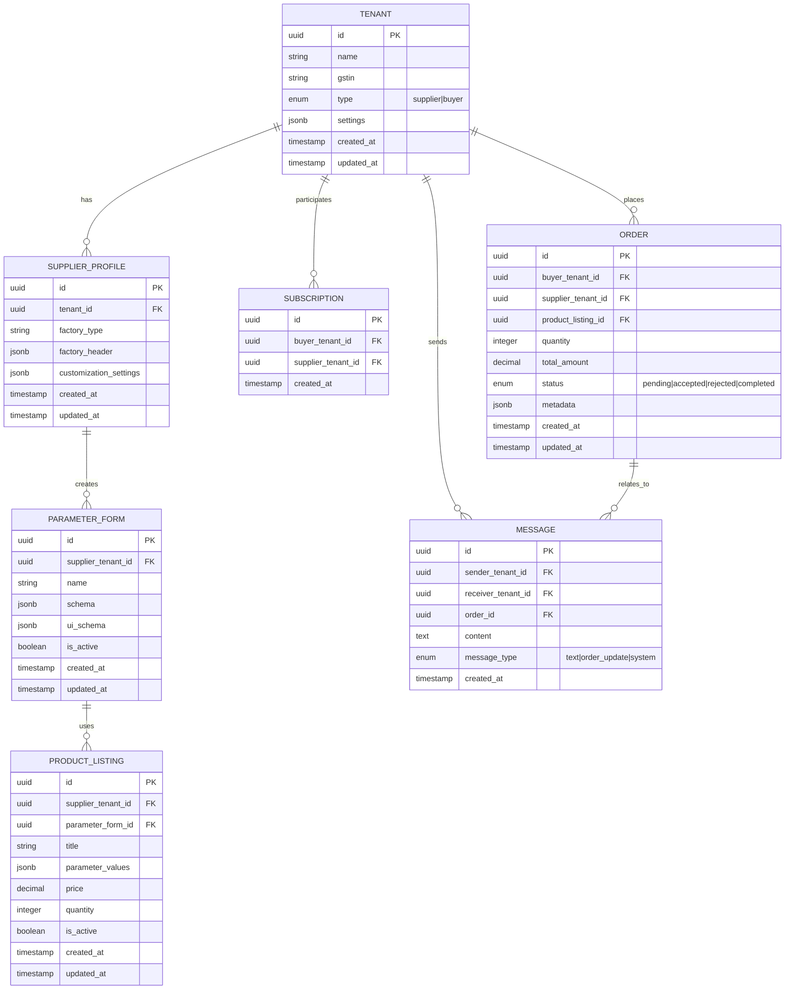

# Design Document: Supply Chain Management System

## Overview

The Supply Chain Management System is a full-stack B2B e-commerce platform that connects suppliers and buyers of raw materials through a multi-tenant architecture. The system enables suppliers to create highly customizable product parameter forms and manage their inventory, while buyers can discover suppliers, browse products with dynamic interfaces, and place orders.

Key architectural principles:
- **Multi-tenant isolation**: Each supplier operates in their own tenant space with customizable UX
- **Dynamic form generation**: JSON Schema-based form builder for flexible product parameters
- **Real-time communication**: WebSocket-based messaging between buyers and suppliers
- **Business verification**: GSTIN integration for authentic business validation
- **Scalable architecture**: Microservices with shared database and separate schemas per tenant

## Architecture

### System Architecture



### Multi-Tenant Database Design

Based on research findings, we'll use a **shared database with separate schemas** approach, which provides good isolation while maintaining reasonable operational overhead.



## Components and Interfaces

### Authentication Service

**Purpose**: Handle user authentication, GSTIN verification, and tenant management.

**Key Components**:
- `AuthController`: REST endpoints for login, registration, verification
- `GSTINValidator`: Integration with external GSTIN verification APIs
- `TenantManager`: Multi-tenant context management
- `JWTService`: Token generation and validation with tenant context

**Interfaces**:
```typescript
interface AuthService {
  register(userData: UserRegistration): Promise<AuthResult>
  login(credentials: LoginCredentials): Promise<AuthResult>
  verifyGSTIN(gstin: string): Promise<GSTINVerificationResult>
  refreshToken(token: string): Promise<AuthResult>
}

interface GSTINVerificationResult {
  isValid: boolean
  businessName: string
  businessType: string
  registrationDate: Date
  status: 'active' | 'inactive' | 'cancelled'
}
```

### Form Service

**Purpose**: Manage dynamic parameter form creation, storage, and rendering using JSON Schema.

**Key Components**:
- `FormBuilder`: Create and edit parameter forms using JSON Schema
- `FormRenderer`: Generate UI components from JSON Schema
- `FormValidator`: Validate form submissions against schemas
- `SchemaManager`: Manage form schema versions and migrations

**Interfaces**:
```typescript
interface FormService {
  createForm(tenantId: string, formData: FormDefinition): Promise<ParameterForm>
  updateForm(formId: string, formData: FormDefinition): Promise<ParameterForm>
  getForm(formId: string): Promise<ParameterForm>
  listForms(tenantId: string): Promise<ParameterForm[]>
  validateFormData(formId: string, data: any): Promise<ValidationResult>
}

interface FormDefinition {
  name: string
  schema: JSONSchema7
  uiSchema: UISchema
  metadata: FormMetadata
}
```

### Product Service

**Purpose**: Manage product listings with dynamic parameter values and search functionality.

**Key Components**:
- `ProductManager`: CRUD operations for product listings
- `SearchEngine`: Product search and filtering with tenant isolation
- `ParameterProcessor`: Handle dynamic parameter values and validation
- `InventoryTracker`: Track product availability and quantities

**Interfaces**:
```typescript
interface ProductService {
  createProduct(tenantId: string, productData: ProductCreation): Promise<Product>
  updateProduct(productId: string, productData: ProductUpdate): Promise<Product>
  getProduct(productId: string): Promise<Product>
  searchProducts(criteria: SearchCriteria): Promise<ProductSearchResult>
  getSupplierProducts(supplierTenantId: string): Promise<Product[]>
}

interface ProductCreation {
  parameterFormId: string
  title: string
  parameterValues: Record<string, any>
  price: number
  quantity: number
}
```

### Communication Service

**Purpose**: Handle real-time messaging between buyers and suppliers using WebSockets.

**Key Components**:
- `MessageHandler`: Process and route messages between tenants
- `WebSocketManager`: Manage WebSocket connections with tenant context
- `NotificationService`: Send notifications for orders and messages
- `ConversationManager`: Organize messages into conversations

**Interfaces**:
```typescript
interface CommunicationService {
  sendMessage(message: MessageData): Promise<Message>
  getConversation(tenantId1: string, tenantId2: string): Promise<Message[]>
  subscribeToMessages(tenantId: string, callback: MessageCallback): void
  notifyOrderUpdate(orderId: string, status: OrderStatus): Promise<void>
}

interface MessageData {
  senderTenantId: string
  receiverTenantId: string
  content: string
  messageType: 'text' | 'order_update' | 'system'
  orderId?: string
}
```

### Order Service

**Purpose**: Manage order lifecycle from creation to completion.

**Key Components**:
- `OrderManager`: Handle order creation, updates, and status changes
- `OrderProcessor`: Process order acceptance/rejection logic
- `OrderNotifier`: Send notifications for order status changes
- `OrderValidator`: Validate order data and business rules

**Interfaces**:
```typescript
interface OrderService {
  createOrder(orderData: OrderCreation): Promise<Order>
  updateOrderStatus(orderId: string, status: OrderStatus, metadata?: any): Promise<Order>
  getOrder(orderId: string): Promise<Order>
  getOrdersForTenant(tenantId: string, role: 'buyer' | 'supplier'): Promise<Order[]>
}

interface OrderCreation {
  buyerTenantId: string
  supplierTenantId: string
  productListingId: string
  quantity: number
  metadata?: Record<string, any>
}
```

## Data Models

### Core Entities

**Tenant Model**:
```typescript
interface Tenant {
  id: string
  name: string
  gstin: string
  type: 'supplier' | 'buyer'
  settings: TenantSettings
  createdAt: Date
  updatedAt: Date
}

interface TenantSettings {
  theme?: ThemeSettings
  notifications?: NotificationSettings
  businessInfo?: BusinessInfo
}
```

**Parameter Form Model**:
```typescript
interface ParameterForm {
  id: string
  supplierTenantId: string
  name: string
  schema: JSONSchema7
  uiSchema: UISchema
  isActive: boolean
  createdAt: Date
  updatedAt: Date
}

// JSON Schema example for wood supplier
const woodParameterSchema: JSONSchema7 = {
  type: "object",
  properties: {
    woodType: { type: "string", enum: ["oak", "pine", "mahogany"] },
    color: { type: "string" },
    composition: { type: "string" },
    dimensions: {
      type: "object",
      properties: {
        length: { type: "number" },
        width: { type: "number" },
        thickness: { type: "number" }
      }
    },
    grade: { type: "string", enum: ["A", "B", "C"] }
  },
  required: ["woodType", "color", "dimensions"]
}
```

**Product Listing Model**:
```typescript
interface ProductListing {
  id: string
  supplierTenantId: string
  parameterFormId: string
  title: string
  parameterValues: Record<string, any>
  price: number
  quantity: number
  isActive: boolean
  createdAt: Date
  updatedAt: Date
}
```

### Dynamic Form Processing

The system uses JSON Schema for form definition and validation, with UI Schema for rendering customization:

```typescript
interface UISchema {
  [key: string]: {
    "ui:widget"?: string
    "ui:options"?: Record<string, any>
    "ui:placeholder"?: string
    "ui:help"?: string
    "ui:order"?: string[]
  }
}

// Example UI Schema for wood parameters
const woodUISchema: UISchema = {
  woodType: {
    "ui:widget": "select",
    "ui:placeholder": "Select wood type"
  },
  color: {
    "ui:widget": "color",
    "ui:help": "Select the primary color of the wood"
  },
  dimensions: {
    "ui:order": ["length", "width", "thickness"]
  }
}
```

## Correctness Properties

*A property is a characteristic or behavior that should hold true across all valid executions of a system—essentially, a formal statement about what the system should do. Properties serve as the bridge between human-readable specifications and machine-verifiable correctness guarantees.*

### Property 1: Authentication Success and Failure
*For any* user credentials (supplier or buyer), authentication should succeed if and only if the credentials are valid, and should fail with appropriate error messages for invalid credentials.
**Validates: Requirements 1.1, 6.1**

### Property 2: GSTIN Verification Round Trip
*For any* GSTIN number, the system should correctly verify it against external services, store the verification result, and grant or deny access based on the verification outcome.
**Validates: Requirements 1.2, 1.3, 1.4, 6.2, 6.3, 6.4, 10.1, 10.2, 10.3**

### Property 3: Verification Status Persistence
*For any* authenticated user, once their verification status is set (verified or unverified), that status should persist across all subsequent sessions and operations.
**Validates: Requirements 1.5, 6.5**

### Property 4: Factory Information Persistence
*For any* supplier factory information (type, header details), when saved, the information should be persistently stored and retrievable, and should be updatable without data loss.
**Validates: Requirements 2.2, 2.3, 2.4, 2.5**

### Property 5: Parameter Form Creation and Management
*For any* supplier, they should be able to create multiple parameter forms with different field types, and these forms should be available for product listing creation without affecting existing product listings when modified.
**Validates: Requirements 3.2, 3.3, 3.4, 3.5, 3.6**

### Property 6: Product Listing Creation and Association
*For any* valid parameter form and product data, creating a product listing should correctly associate the product with its form structure, make it discoverable by buyers, and allow editing while maintaining the form relationship.
**Validates: Requirements 4.3, 4.4, 4.5, 4.6**

### Property 7: Order Status Management
*For any* order, when a supplier accepts or rejects it, the order status should be updated correctly, appropriate notifications should be sent to the buyer, and the order should appear in both parties' order history.
**Validates: Requirements 5.3, 5.4, 5.5**

### Property 8: Subscription Management
*For any* buyer-supplier pair, subscription and unsubscription operations should correctly add or remove the relationship, and the subscribed suppliers list should accurately reflect only subscribed suppliers.
**Validates: Requirements 7.2, 7.3, 7.4, 7.6**

### Property 9: Message Delivery and History
*For any* message sent between buyer and supplier, the message should be delivered to the recipient, stored in conversation history, and remain accessible for future reference.
**Validates: Requirements 9.2, 9.5**

### Property 10: Order Creation and Notification
*For any* valid order placement, an order record should be created with correct product and quantity details, and the relevant supplier should be notified immediately.
**Validates: Requirements 9.3, 5.1, 9.4**

### Property 11: GSTIN Service Integration Resilience
*For any* GSTIN verification request, the system should handle external service timeouts gracefully, provide retry mechanisms, and maintain audit logs of all verification attempts.
**Validates: Requirements 10.4, 10.5**

### Property 12: Multi-Tenant Data Isolation
*For any* supplier tenant, their parameter forms, products, and data should be completely isolated from other suppliers, with no cross-tenant data leakage even under concurrent access.
**Validates: Requirements 11.1, 11.3, 11.4**

## Error Handling

### GSTIN Verification Failures
- **Timeout Handling**: Implement exponential backoff retry mechanism with maximum 3 attempts
- **Invalid GSTIN Response**: Provide specific error messages based on verification failure reason
- **Service Unavailability**: Graceful degradation with manual verification option for administrators

### Form Schema Validation Errors
- **Invalid JSON Schema**: Validate schema structure before saving parameter forms
- **Schema Migration**: Handle form schema updates without breaking existing product listings
- **Parameter Validation**: Provide detailed validation errors for form submissions

### Multi-Tenant Isolation Failures
- **Tenant Context Loss**: Implement middleware to ensure tenant context is always present
- **Cross-Tenant Access Attempts**: Log and block any attempts to access data across tenant boundaries
- **Concurrent Access Issues**: Use database-level row locking to prevent race conditions

### Communication Service Errors
- **WebSocket Connection Failures**: Implement automatic reconnection with exponential backoff
- **Message Delivery Failures**: Store messages in queue for retry delivery
- **Real-time Notification Issues**: Fallback to email notifications if WebSocket delivery fails

### Order Processing Errors
- **Inventory Conflicts**: Handle concurrent order attempts for limited inventory
- **Payment Integration Failures**: Implement proper transaction rollback mechanisms
- **Status Update Conflicts**: Use optimistic locking to prevent status update race conditions

## Testing Strategy

### Dual Testing Approach

The system will employ both unit testing and property-based testing to ensure comprehensive coverage:

**Unit Tests**:
- Specific examples and edge cases for each component
- Integration points between services
- Error conditions and boundary cases
- Authentication flows with specific credentials
- GSTIN verification with known test cases
- Form creation with specific schema examples

**Property-Based Tests**:
- Universal properties that hold across all inputs
- Comprehensive input coverage through randomization
- Minimum 100 iterations per property test
- Each test tagged with corresponding design property

### Property-Based Testing Configuration

**Framework Selection**: 
- **Backend (Node.js/TypeScript)**: Use `fast-check` library for property-based testing
- **Frontend (React/TypeScript)**: Use `fast-check` with React Testing Library for UI property tests

**Test Configuration**:
- Minimum 100 iterations per property test
- Custom generators for domain-specific data (GSTIN numbers, form schemas, product data)
- Shrinking enabled to find minimal failing examples
- Timeout configuration for external service integration tests

**Property Test Tagging**:
Each property-based test must include a comment with the format:
```typescript
// Feature: supply-chain-management, Property 1: Authentication Success and Failure
```

### Test Data Generation

**Custom Generators**:
- `GSTINGenerator`: Generate valid and invalid GSTIN numbers for testing
- `FormSchemaGenerator`: Create various JSON Schema configurations for parameter forms
- `ProductDataGenerator`: Generate product listings with different parameter combinations
- `TenantDataGenerator`: Create isolated tenant data for multi-tenancy testing

**Test Environment**:
- Isolated test database with tenant separation
- Mock GSTIN verification service for consistent testing
- WebSocket test server for communication testing
- Redis test instance for caching validation

### Integration Testing

**Service Integration**:
- End-to-end workflows from user registration to order completion
- Cross-service communication validation
- External service integration (GSTIN API) with mocked responses
- Database transaction integrity across service boundaries

**Performance Testing**:
- Concurrent user access with tenant isolation
- Form rendering performance with complex schemas
- WebSocket connection scaling under load
- Database query performance with multi-tenant data